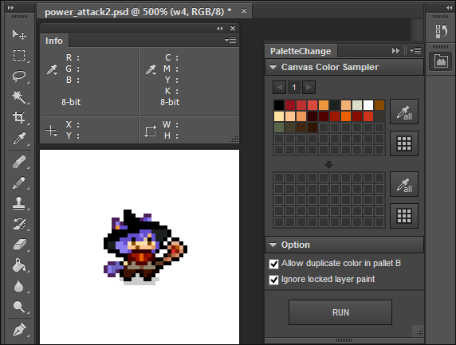

PaletteChange
=======

PaletteChange is a extension panel for Photoshop CC

PaletteChange は Photoshop CC 用拡張パネルです。

It's repainted in Palette B Colors from Palette C Colors which is being used by canvas to all layers.

全てのレイヤーに対し、キャンバス内で使用されているパレットAの色を パレットBの色に塗り替えます。

## Download
## ダウンロード

* [PaletteChange.zxp](https://raw.github.com/siratama/PaletteChange/master/download/PaletteChange.zxp)

In the case of Windows, it can save from a right-click. [Adobe Extension Manager CC(Free)](http://www.adobe.com/exchange/em_download/) is required in order to install. 

Windows の場合、右クリックから「リンク先のコンテンツを保存」を選択で保存できます。インストールには別途 [Adobe Extension Manager CC(無料)](http://www.adobe.com/jp/exchange/em_download/)が必要です。

## Feature
## 機能

### Canvas scan function
### キャンバススキャン機能

All color of the selection layer (active layer) is picked out, and it's registered with a palette automatically.

選択したレイヤー(アクティブレイヤー)内のすべての色を抽出し、パレットに自動的に登録します。

### Canvas selection function with the palette color
### パレット色のキャンバス選択機能

When the color of the palette is chosen, the color in the canvas is selected.

パレットの色を選択すると、キャンバス内でその色が使用されている箇所が選択されます。

Note: It's selected based on the last information from which the color was picked out.
When being not selected, it's necessary to pick out first.

※色を抽出した最後の情報を元に選択が行われます。選択されない場合は、まず抽出を行う必要があります。

## Recommendation setting
## 推奨設定

### Please arrange PaletteChange panel and Infomation panel at the separate place.
### PaletteChange パネルと情報ウインドウパネルは別々の場所に配置を

The color in the canvas is picked out using the color sampler function of Photoshop in PaletteChange.
Therefore an information window opens automatically.

PaletteChange では、Photoshop のカラーサンプラー機能を用いてキャンバス内の色の抽出を行います。
これにより、情報ウインドウが自動で開きます。

When a PaletteChange panel and an information window fit into an identical part, 
during processing it, 
an information window opens automatically and becomes difficult to press down on the cancel button when would like to stop processing.

PaletteChange パネルと情報ウインドウが同一の箇所に収まっていると
処理中は情報ウインドウが自動的に開いてしまい、
処理を中断したい場合の CANCEL ボタンが押しにくくなってしまいます。

I'll recommend to put a PaletteChange panel and an information window panel in the separate location from the above.

よって、PaletteChange パネルと情報ウインドウパネルは
別々の位置に収める事をおすすめします。

## The main use
## 主な用途

When you'd like to change the color of the specific or everything in pixelart to the different color, it can be used.
Even if a layer is plural, it's effective.

ドット絵内の特定の色、あるいは全ての色を 別の色に変更したい場合に利用します。
レイヤーが複数であっても有効です。

When you'd like to change the pixelart frame animation to the different color pattern, PaletteChange is very useful.

ドット絵フレームアニメーションで、
違う色パターンのアニメーションを作成したい場合、当 PaletteChange は大いに役に立ちます。

図

## Weakness
## 難点

The processing speed of PaletteChange isn't that fast. It takes time for processing to a figure with the big shape very much.

PaletteChange の処理速度はあまり早くはありません。大きな形状の図形に対する処理はとても時間がかかります。

For example in case of a figure of 100x100 pixel, the color sampling takes time for more than 5 minutes to 1 layer.
(Time changes by the performance of the PC.)

例えば、図のサイズが 100x100 px の場合、1レイヤーに付き、5分以上 色抽出に時間を要する事もあります。(PCの性能により時間は上下します)

Therefore PaletteChange assumes use to a small pixelart.

よって PaletteChange は小さめの図、ドット絵に対して実行する事を想定しています。

Note: The color is sampled along the shape of the figure. The document size won't be a sample area.

※図の形状にそって色抽出を行うため、ドキュメントサイズがそのまま色抽出範囲になるわけではありません。

図

## How to use
## 使い方

図：メインウインドウと色編集ウインドウ: 図内各名称のナビ

### SCAN button
### SCAN ボタン

All color of the selection layer (active layer) is picked out and registered with a palette automatically.

選択したレイヤー(アクティブレイヤー)内のすべての色を抽出し、パレットに自動的に登録します。

### Palette clear button
### PALETTE CLEAR ボタン

The color registered with a palette is erased completely.

パレットに登録している色を全て消去します。

### Edit color
### 色編集

パレット内 セルをクリックする事で任意の色を追加・編集できます。
パレットA の場合、すでに登録してある色を追加する事はできません。

すでにセルが着色されている場合、専用のウインドウが開く他、
セルの色が使用されているキャンバス内ピクセルが選択されます。
選択されない場合「SELECT CANVAS ボタン」で選択する事ができます。

図

### Edit Color: Edit button
### 色編集 EDIT ボタン

色の変更を行います。

### Edit Color: Select canvas button
### 色編集 SELECT CANVAS ボタン

キャンバス内でセルの色が使用されている場所を調査し、色が見つかった場合 選択が行われます。

### Run button
### RUN ボタン

全てのレイヤーに対し、キャンバス内で使用されているパレットAの色を パレットBの色に塗り替えます。

## Optional Setting
## オプション設定

### パレットB の色の重複の 許可/非許可

デフォルトでは許可しています。パレットB でも色の重複を許可しない場合、チェックを外してください。

### 選択されたロックレイヤーの色変更処理は 無視/有効

RUN ボタンによる、ロックしているレイヤーの色の塗替えを 無効/有効化 します。

塗替えを実行したくないレイヤーは、あらかじめロックしておくとよいです。
Windows の場合「Ctrl + /」で、まとめてロックの切り替えがを行うことができます。

## Others
## その他 

### 背景レイヤーの扱い

Photoshop デフォルト設定では、psd ファイル新規作成時、「背景レイヤー」が自動的に作成されます。
「背景レイヤー」は通常のレイヤーとは異なり、「表示切り替え不可・ロックは外せない・着色が可能」なレイヤーとなります。

PaletteChange では「背景レイヤー」からの色の抽出は可能ですが、「背景レイヤー」への色の着色は対応していません。

### Photoshop CC フレームアニメーション作成機能には不具合あり

Photoshop CC のフレームアニメーション機能では、
「下のレイヤーと結合」を行うと、結合されたレイヤーが全てのフレームで表示されてしまう不具合があります。

詳細(英語)
adobe forum URL

PaletteChange は Photoshop CC でしか動作しませんが、
上記不具合を回避するために、フレームアニメーション作成は CS6 を使ったほうが良い、という状況となっています。

### jsx からのカラーサンプル(色抽出)機能に不具合あり

開発者向け情報です。

Photoshop CC jsx では、キャンバス内のピクセル色を抽出するために ColorSamplers クラスを利用します。
しかし ColorSamplers クラスでは、
抽出対象のピクセルを整数値で指定しても正常な色情報が取得できない、という不具合があります。

参考
URL

対処策としまして、上記サイトにあるとおり、
ピクセル整数値に 0.1 という値を加える事で 何故かこの不具合を回避できます。

## Using library
## 使用ライブラリ

haxe-cep

