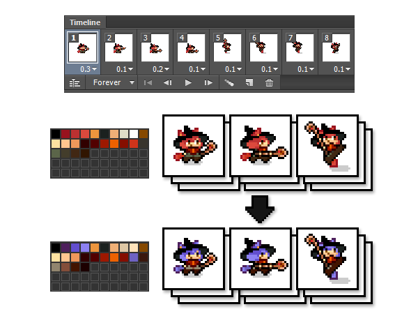
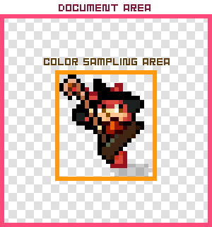

PaletteChange
=======
Document Language [English] | [[Japanese]](README_jp.md)

PaletteChange is a extension panel for Photoshop CC

It's repainted in Palette B Colors from Palette C Colors which is being used by canvas to all layers.

## Introduction movie

[http://youtu.be/35kD5Nu2WOw](http://youtu.be/35kD5Nu2WOw)

## Download

* [PaletteChange.zxp](https://raw.github.com/siratama/PaletteChange/master/download/PaletteChange.zxp)

In the case of Windows, it can save from a right-click. [Adobe Extension Manager CC(Free)](http://www.adobe.com/exchange/em_download/) is required in order to install. 

## Feature

### Canvas scan function

All color of the selection layer (active layer) is picked out, and it's registered with a palette automatically.

### Canvas selection function with the palette color

When the color of the palette is chosen, the color in the canvas is selected.

Note: It's selected based on the last information from which the color was picked out.
When being not selected, it's necessary to pick out first.

## Recommendation setting

### Please arrange PaletteChange panel and Infomation panel at the separate place.

The color in the canvas is picked out using the color sampler function of Photoshop in PaletteChange.
Therefore an information window opens automatically.

When a PaletteChange panel and an information window fit into an identical part, 
during processing it, 
an information window opens automatically and becomes difficult to press down on the cancel button when would like to stop processing.

I'll recommend to put a PaletteChange panel and an information window panel in the separate location from the above.

## The main use

When you'd like to change the color of the specific or everything in pixelart to the different color, it can be used.
Even if a layer is plural, it's effective.

When you'd like to change the pixelart frame animation to the different color pattern, PaletteChange is very useful.

## Weakness

The processing speed of PaletteChange isn't that fast. It takes time for processing to a figure with the big shape very much.

For example in case of a figure of 100x100 pixel, the color sampling takes time for more than 5 minutes to 1 layer.
(Time changes by the performance of the PC.)

Therefore PaletteChange assumes use to a small pixelart.

Note: The color is sampled along the shape of the figure. The document size won't be a sample area.

## How to use

### Scan canvas button

All color of the selection layer (active layer) is picked out and registered with a palette automatically.

### Clear palette button

The color registered with a palette is erased completely.

### Edit palette color

The color can be edited by clicking a cell in the palette.

The registered color can't be added to the palette A.

When a cell is colored already, an edit palette color window opens.
A pixel in the canvas with the color of the cell is selected.
When being not selected, it can be selected by SELECT CANVAS button.

### Edit palette color: EDIT button

The color is edited.

### Edit palette color: SELECT CANVAS button

The color checks the position with the color of the cell in the canvas, and when being found, is selected.

### RUN button

The color of the palette A used in the canvas is repainted in the color of the palette B to all layers.

## Optional Setting

### Allow duplicate color in palette B

It's allowed by default. When even palette B doesn't allow an overlap with the color, please remove a check.

### Ignore locked layer paint

Repainting with the color of the locked layer by the RUN button is valid or invalid.

Lock the layer you don't want to repaint.
You can change lock together by "Ctrl + /" in case of Windows.

## Others

### About background layer

"Background layer" is made automatically at the time of psd file creation by a default setting of Photoshop.
"Background layer" is different from a usual layer and is a special layer.

Color sampling from "background layer" is possible, but PaletteChange can't color to "background layer".

### There is a bug in the frame animation making function of Photoshop CC. 

[Photoshop CC: Layer Merging Behavior with Timeline Animations (Bug?)](https://forums.adobe.com/thread/1355933)

## Using library

* [haxe-cep](https://github.com/siratama/haxe-cep)
* [original haxe-cep](https://github.com/tmskst/haxe-cep)
