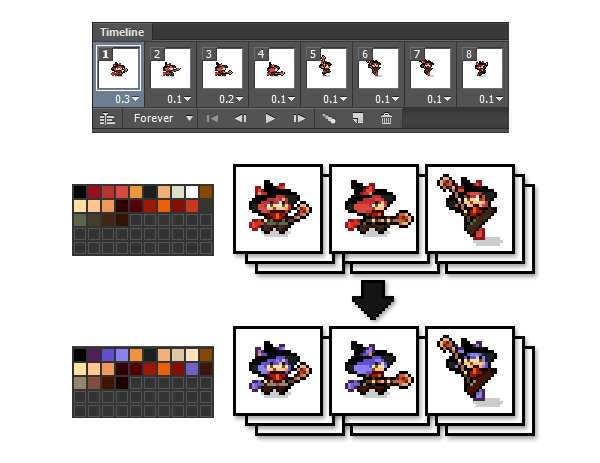
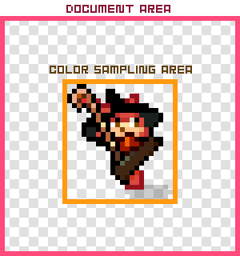
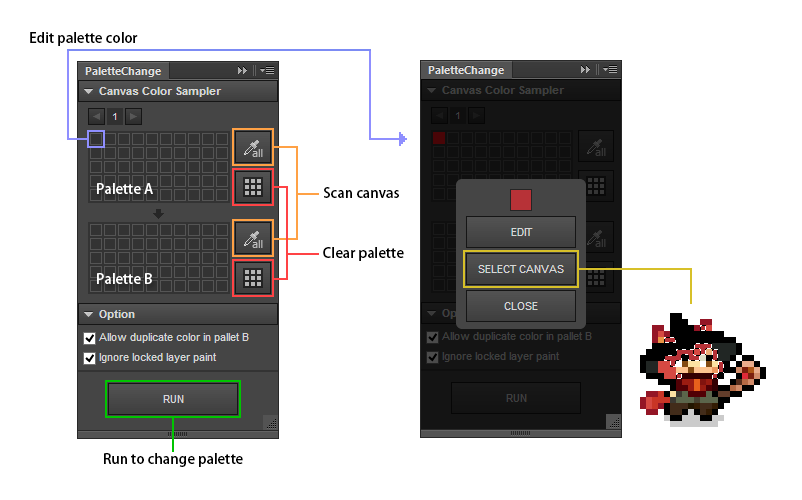

PaletteChange
=======

Document Language [[English](README.md)] | [Japanese]

PaletteChange は Photoshop CC 用拡張パネルです。

全てのレイヤーに対し、キャンバス内で使用されているパレットAの色を パレットBの色に塗り替えます。

## 紹介動画

[http://youtu.be/35kD5Nu2WOw](http://youtu.be/35kD5Nu2WOw)

## ダウンロード

* [PaletteChange.zxp](https://raw.github.com/siratama/PaletteChange/master/download/PaletteChange.zxp)

Windows の場合、右クリックから「リンク先のコンテンツを保存」を選択で保存できます。インストールには別途 [Adobe Extension Manager CC(無料)](http://www.adobe.com/jp/exchange/em_download/)が必要です。

## 機能

### キャンバススキャン機能

選択したレイヤー(アクティブレイヤー)内のすべての色を抽出し、パレットに自動的に登録します。

### パレット色のキャンバス選択機能

パレットの色を選択すると、キャンバス内でその色が使用されている箇所が選択されます。

※色を抽出した最後の情報を元に選択が行われます。選択されない場合は、まず抽出を行う必要があります。

## 推奨設定

### PaletteChange パネルと情報ウインドウパネルは別々の場所に配置を

PaletteChange では、Photoshop のカラーサンプラー機能を用いてキャンバス内の色の抽出を行います。
これにより、情報ウインドウが自動で開きます。

PaletteChange パネルと情報ウインドウが同一の箇所に収まっていると
処理中は情報ウインドウが自動的に開いてしまい、
処理を中断したい場合の CANCEL ボタンが押しにくくなってしまいます。

よって、PaletteChange パネルと情報ウインドウパネルは
別々の位置に収める事をおすすめします。

## 主な用途

ドット絵内の特定の色、あるいは全ての色を 別の色に変更したい場合に利用します。
レイヤーが複数であっても有効です。

ドット絵フレームアニメーションで、
違う色パターンのアニメーションを作成したい場合、当 PaletteChange は大いに役に立ちます。

## 難点

PaletteChange の処理速度はあまり早くはありません。大きな形状の図形に対する処理はとても時間がかかります。

例えば、図のサイズが 100x100 px の場合、1レイヤーに付き、5分以上 色抽出に時間を要する事もあります。(PCの性能により時間は上下します)

よって PaletteChange は小さめの図、ドット絵に対して実行する事を想定しています。

※図の形状にそって色抽出を行うため、ドキュメントサイズがそのまま色抽出範囲になるわけではありません。

## 使い方

### SCAN ボタン

選択したレイヤー(アクティブレイヤー)内のすべての色を抽出し、パレットに自動的に登録します。

### PALETTE CLEAR ボタン

パレットに登録している色を全て消去します。

### パレット色編集

パレット内 セルをクリックする事で任意の色を追加・編集できます。

パレットA の場合、すでに登録してある色を追加する事はできません。

すでにセルが着色されている場合、専用のウインドウが開く他、
セルの色が使用されているキャンバス内ピクセルが選択されます。
選択されない場合「SELECT CANVAS ボタン」で選択する事ができます。

### パレット色編集 EDIT ボタン

色の変更を行います。

### パレット色編集 SELECT CANVAS ボタン

キャンバス内でセルの色が使用されている場所を調査し、色が見つかった場合 選択が行われます。

### RUN ボタン

全てのレイヤーに対し、キャンバス内で使用されているパレットAの色を パレットBの色に塗り替えます。

## オプション設定

### Allow duplicate color in palette B: パレットB の色の重複の 許可/非許可

デフォルトでは許可しています。パレットB でも色の重複を許可しない場合、チェックを外してください。

### Ignore locked layer paint: 選択されたロックレイヤーの色変更処理は 無視/有効

RUN ボタンによる、ロックしているレイヤーの色の塗替えを 無効/有効化 します。

塗替えを実行したくないレイヤーは、あらかじめロックしておくとよいです。
Windows の場合「Ctrl + /」で、まとめてロックの切り替えを行うことができます。

## その他 

### 背景レイヤーの扱い

Photoshop デフォルト設定では、psd ファイル新規作成時、「背景レイヤー」が自動的に作成されます。
「背景レイヤー」は通常のレイヤーとは異なり、「表示切り替え不可・ロックは外せない・着色が可能」なレイヤーとなります。

PaletteChange では「背景レイヤー」からの色の抽出は可能ですが、「背景レイヤー」への色の着色は対応していません。

### Photoshop CC フレームアニメーション作成機能には不具合あり

Photoshop CC のフレームアニメーション機能では、
「下のレイヤーと結合」を行うと、結合されたレイヤーが全てのフレームで表示されてしまう不具合があります。

[Photoshop CC: Layer Merging Behavior with Timeline Animations (Bug?)](https://forums.adobe.com/thread/1355933)

PaletteChange は Photoshop CC でしか動作しませんが、
上記不具合を回避するために、フレームアニメーション作成は CS6 を使ったほうが良い、という状況となっています。

## 今後

ColorSamplers による色抽出処理に時間が多くとられてしまっているため、以下で改善できないか考案中。

* 色抽出対象のレイヤーを画像出力
* 拡張パネルから出力した画像読み込み
* 拡張パネルからの HTML5 Canvas で読み込んだ画像の色情報抽出

ユーザに画像出力用のディレクトリを指定してもらう必要がありそうですが、速度改善が見込めるのであれば試したいところです。

## 使用ライブラリ

* [haxe-cep](https://github.com/siratama/haxe-cep)
* [original haxe-cep](https://github.com/tmskst/haxe-cep)
